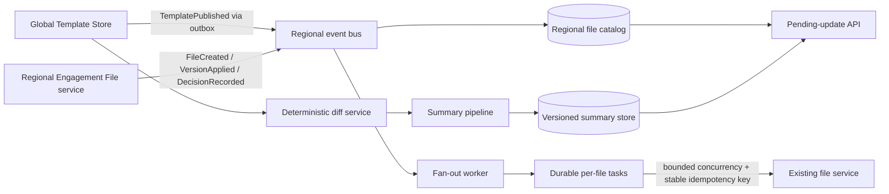

# Pending Product Template Updates — Architecture Design

## Decision and boundaries

The pending-update experience should not load an Engagement File to decide whether an update exists. A one-minute load cannot satisfy a seconds-level product requirement at the stated scale. Instead, each regional deployment maintains a small Engagement File catalog containing only `fileId`, `firmId`, template lineage, market, region, and update-decision metadata. The Engagement File system owns this metadata and publishes changes through a transactional outbox. The update service owns derived pending-update state. Product Template storage remains the source of truth for template versions, version graph, withdrawals, and structured diffs.

The global tier contains no firm data. EU and Canada each run the catalog, task store, queue, API, and workers inside their boundary. Events contain identifiers and version metadata, never audit working papers. The event router sends a firm's events only to its home region.

The H2 application in this repository is the bounded Java implementation of `Fan-out worker`, `Durable per-file tasks`, and the downstream-call contract. It uses ports and adapters: framework-independent domain records sit at the center; application services implement input ports and depend only on output ports; REST and scheduler components are inbound adapters; and Spring Data JPA, transaction handling, and downstream calls are outbound adapters. `WorkerConfiguration` is the composition root that wires these parts through constructor injection. Flyway owns schema evolution and Hibernate validates the mappings. H2 is appropriate for a single-process demonstration. A production deployment would use a regional managed relational database such as Aurora PostgreSQL plus SQS, or DynamoDB plus SQS, because workers must share durable state and survive host loss.

## State model and correctness

A template publication has a globally unique `publicationId`, template, target version, market/branch, publication time, and lifecycle state. A work item is unique on `(publicationId, fileId)`. Delivery is at least once throughout; correctness comes from idempotent consumers rather than an exactly-once claim.

The version model is a directed acyclic graph, not an integer comparison. Each version records its parent edges, market compatibility, publication status, and whether it supersedes or withdraws another version. Eligibility asks whether there is an allowed path from the file's applied version to the offered version. The pending decision is keyed by `(fileId, offeredVersionId, diffHash)`. Rejecting records that exact offer and immutable diff hash; it does not mean “reject all changes contained in this version forever.” A later v7 offer can therefore include previously rejected v5 changes and requires a new decision. Withdrawal removes an offer from the current pending view but retains its history for audit.

On `TemplatePublished`, the worker pages through the regional catalog by immutable `fileId`. Each page transaction creates missing tasks and advances a durable cursor. Reprocessing an event or page is harmless because of the unique constraints. A dispatcher leases tasks, increments the attempt number, and calls the downstream service with a versioned idempotency key that encodes `publicationId` and `fileId` without delimiter ambiguity. The worker renews the lease while the call is active, and success is recorded only by the lease holder. Failures retry with exponential backoff; exhausted work enters a dead-letter state for repair. An expired lease makes crash-abandoned work claimable again.

The demo uses a local concurrency semaphore. Production additionally enforces the downstream team's global concurrency and rate budget at the queue or shared limiter. The downstream operation must persist its idempotency key with its result in the same transaction. Without that contract, a timeout after a successful call can cause duplicate effects.

## Migration and production evolution

Deploy the catalog and consumers dark first. New file creation, update application, rejection, withdrawal, and relevant metadata changes write an outbox event in the source transaction. Consumers accept duplicates and tolerate reordered events using source revision numbers.

Backfill existing files region by region at low priority. A checkpointed scanner emits synthetic `FileIndexed` events. Because the current system requires a one-minute load, the scanner uses a separately negotiated capacity pool and pauses automatically when interactive latency or error budgets degrade. Live outbox events win over older backfill revisions, preventing stale scans from overwriting current metadata. Reconciliation compares source counts and sampled records, then a shadow API comparison validates results before the feature flag is enabled by firm. No maintenance window is required.

During rollout, the read API can return `indexing` for firms not yet covered rather than presenting an incorrect “no updates” result. Schema changes follow expand/migrate/contract: readers accept both forms, writers populate both, backfill completes, then old fields are retired.

## Scale, latency, and cost

There are 800,000 active files across 40 products, or 20,000 files per product on average. At one weekly publication per product, the system receives about `40 × 52 / 12 = 173` publications per month. If every product update touches every file using that product, it creates approximately `173 × 20,000 = 3.46 million` file tasks per month.

The downstream service takes 60 seconds per file. With concurrency `C`, throughput is `C / 60` files per second and a typical 20,000-file publication takes `333.3 / C` hours. At `C=100`, the typical completion time is 3.3 hours and 40,000 files take 6.7 hours. Processing 3.46 million calls consumes about 57,700 downstream concurrency-hours per month regardless of worker count. This proves that complete per-file loading cannot meet “within seconds”; the seconds-level indicator must come from indexed metadata and the version graph. The slow fan-out can reconcile or prepare file-specific work asynchronously.

The Java worker creates at most 500 tasks per page and 50,000 per scheduled run with the default settings. A compact task row plus indexes can be budgeted at roughly 0.5–1 KB, producing 1.7–3.5 GB per month before replication. Completed tasks should move to cheap audit storage after 30–90 days.

Because the monthly limit is given only as `$X`, cost is expressed as a gate:

`monthly cost = regional database + queue requests + worker compute + observability + summary inference + retained audit storage < X`.

Template summaries are shared. Generating one summary per relevant `(fromVersion, targetVersion, locale)` path is far cheaper than generating one per file. If `N` summaries use `Tin` input tokens and `Tout` output tokens, inference cost is `N × (Tin × inputPrice + Tout × outputPrice) / 1,000,000`. The service records actual tokens and cost by publication and disables optional regeneration when the monthly forecast approaches the budget. Final vendor prices and `$X` must be supplied before a numerical approval.

## Human-readable summaries and auditability

The deterministic JSON diff is canonical. A normalization step groups changes by domain concept and removes ordering noise. A constrained LLM may turn those groups into plain language, but it cannot determine eligibility, approval, or application behavior. The prompt instructs the model to cite diff object identifiers and avoid claims unsupported by the input.

Every rendered summary stores the source and target template ids, exact template artifact hashes, canonical diff and hash, prompt template version, model/provider/version, generation parameters, output, locale, safety checks, evaluation result, and approval state. These immutable artifacts allow a March summary to be reproduced and explained during a November review even if the live model has changed.

Evaluation combines schema and citation checks, regression examples approved by content specialists, omission and contradiction scoring against the deterministic diff, and human review for high-impact changes. Production sampling monitors edits, user rejection patterns, and unsupported-claim incidents. A failed or unavailable model falls back to deterministic grouped change text rather than blocking publication.

## Operations, SLOs, and recovery

Proposed SLOs are: 99.9% of valid publication events durably acknowledged within one second; 99% of catalog-backed pending indicators queryable within five seconds of publication; 99.9% read availability per region; and 99% of downstream tasks completed within the capacity-derived target agreed with the owning team. The last target cannot be honestly set until global downstream concurrency is known.

Metrics cover event age, fan-out cursor age, queue depth and oldest age, active calls, lease recoveries, retries, dead letters, downstream latency/error rate, catalog lag, summary generation failures, and cost. Alerts use queue age and error-budget burn rather than raw task count. Structured logs carry `publicationId`, `fileId`, `firmId`, region, attempt, and idempotency key while excluding working-paper content.

Regional databases use point-in-time recovery and tested restores. Queue messages are replayable from the outbox/archive. Rebuilding derived state from template history plus Engagement File events is a supported runbook. If a region fails, processing remains in-region and resumes there; residency rules take priority over automatic cross-region failover.

## Trade-offs, largest risk, and exclusions

The requirement I would challenge is “all files updated within seconds” if it implies completing the one-minute per-file call. The feasible product contract is that the pending indicator and shared summary appear within seconds, while file-specific reconciliation completes under a capacity-based SLO.

The riskiest implementation detail is the combined version-graph and rejection semantics. A mistaken definition can silently hide required changes or repeatedly offer rejected content. It needs domain-owned examples, property tests over graph paths, and an immutable decision ledger. The second major risk is assuming local concurrency equals global protection; production must enforce capacity across every worker instance and region.

Deliberately excluded are applying template content, editing confidential working papers, the user interface, authentication/authorization, a real template graph resolver, a real message broker, and an LLM integration. The bounded implementation focuses on the required fan-out contracts, persistence, concurrency, failure recovery, and idempotency.
